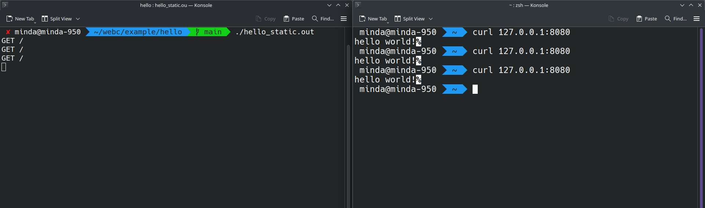

# Webc web server library
WebC is a lightweight HTTP web server library written in C.
It provides method/path routing, request parsing, and response helpers, and can be linked as `libwebc.so` or `libwebc.a`.

## What this project does
WebC runs this flow:
1. Open a server socket on the configured port.
2. Read and parse incoming HTTP requests (method, path, query, headers, body).
3. Find and execute a registered route handler.
4. Write an HTTP response (status, headers, body).

## Features
- `GET` / `POST` route registration
- Query string parsing
- Header/body access API
- Formatted response body helper
- Shared/static library build outputs

## Stability improvements
Recent fixes include:
- Return `400 Bad Request` when request read/parse fails.
- Return `404 Not Found` when no route matches.
- Return `500 Internal Server Error` when a handler returns `NULL`.
- Correct out-of-range port validation.
- Fix dictionary prime-generation edge case.
- Fix dictionary size counting when overwriting existing keys.

## Build
```bash
make
```

Artifacts:
- `lib/libwebc.so`
- `lib/libwebc.a`
- `include/*.h`

## Test (RFC-style request parsing checks)
```bash
make test
```

## Benchmark (request parser microbenchmark)
```bash
make benchmark
# optional custom iterations
./bench/request_parse_bench.out 500000
```

## Run example
```bash
cd example/hello
make
source ../env_set.sh
./hello.out
```

In another terminal:
```bash
curl -i "http://127.0.0.1:8080/"
curl -i "http://127.0.0.1:8080/name?name=webc"
```



## Dependencies
- C compiler (GCC recommended)
- make

## Roadmap
For a structured plan with **Essential (must-have)** and **Nice-to-have** items, see:

- [ROADMAP.md](./ROADMAP.md)
